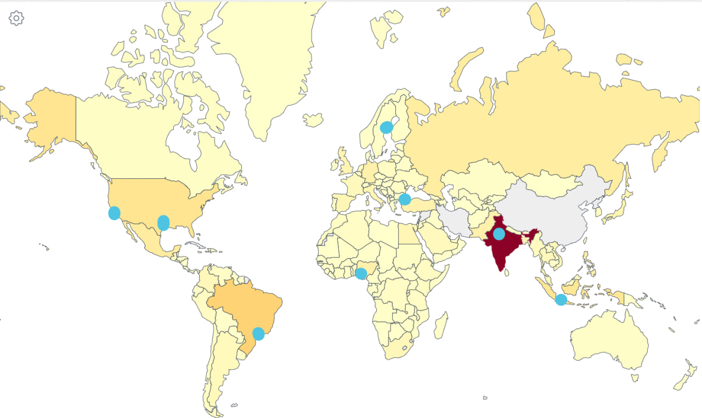
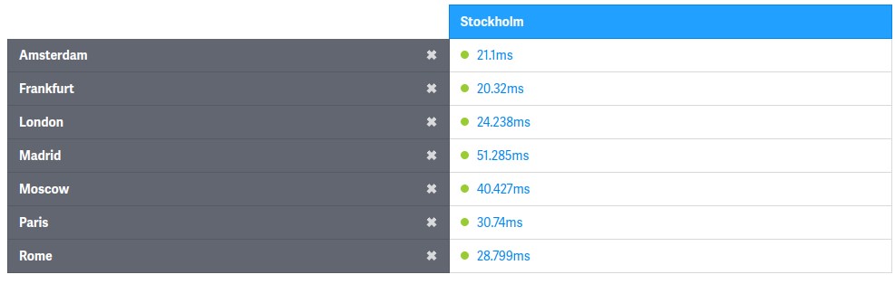
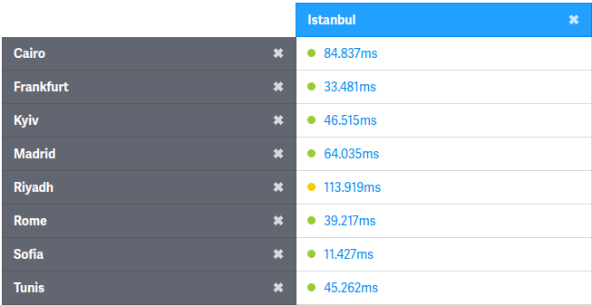
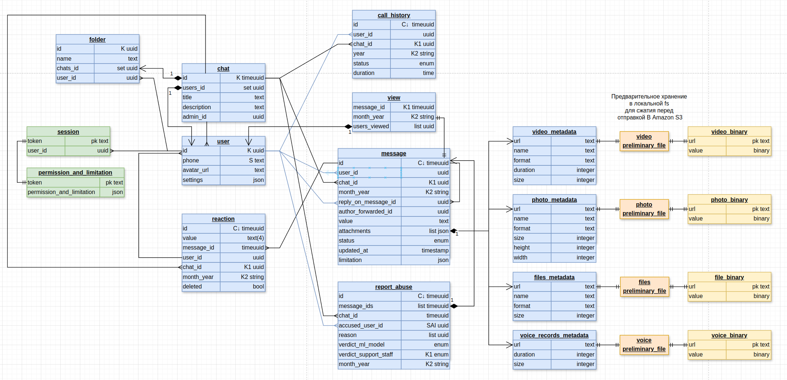
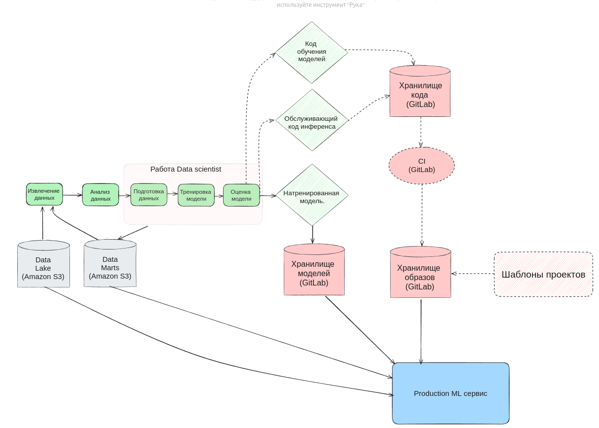
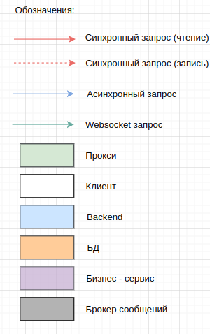
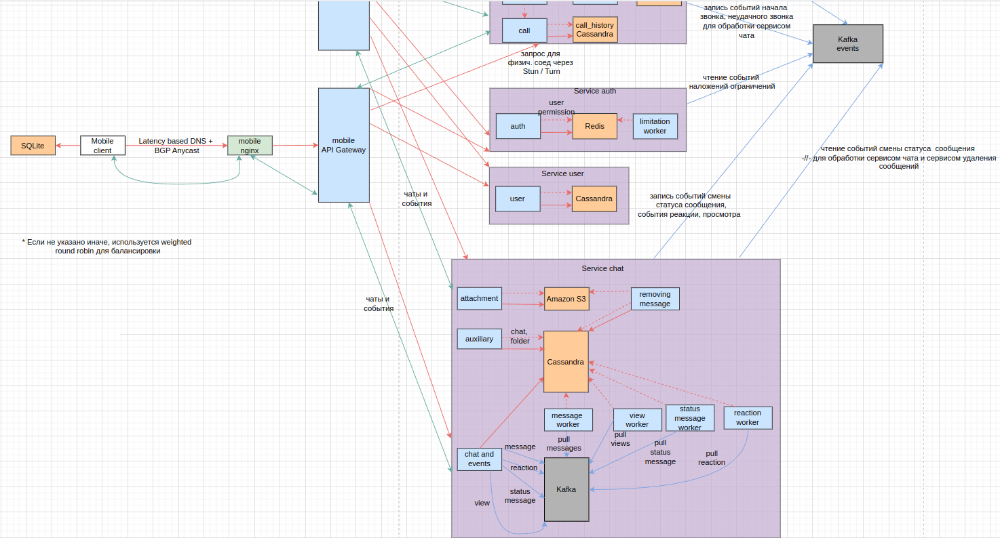
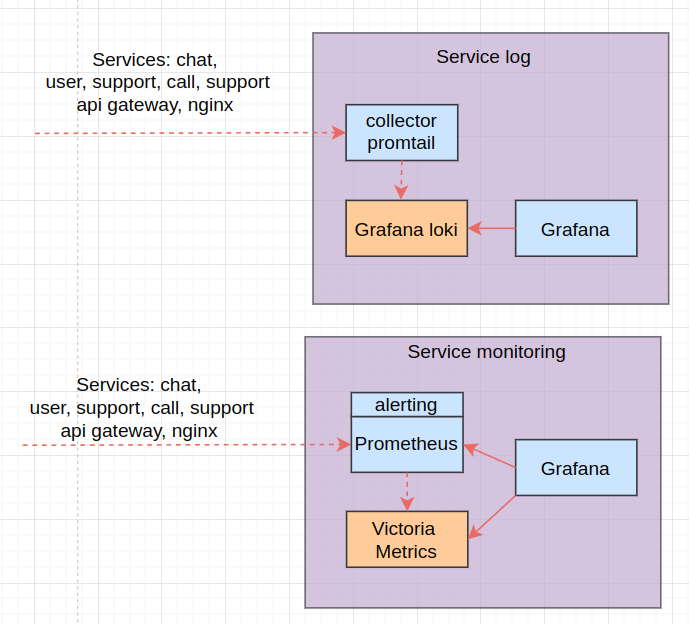

**Ильинский Владислав**

 Этот репозиторий является систем дизайном для мессенджера WhatsApp.

[Телеграм для связи](https://t.me/Vilin0)

[Методические указания](https://github.com/init/highload/blob/main/homework_architecture.md)

## 1. Тема, аудитория, функционал

### Тема: мессенджер Whatsapp

### MVP функционал

1. Отправка сообщений в чате.
2. Просмотр чата.
3. Вложения фото, видео, файлы, голосовые.
4. Поиск сообщений по чатам.
5. Группировка чатов по папкам.
6. Групповой чат с несколькими пользователями.
7. Статус сообщения(отправлено, доставлено, прочитано)

**Ключевые особенности**

* Эмоции на сообщения в виде смайликов.

* Голосовые звонки внутри мессенджера

* Проектировать будем с учетом отсутствия постоянного хранения сообщений на серверах.
Т.е. сообщения могут храниться только пока адресат не доступен. 
После доставки сообщения удаляются с серверов.
Можно хранить метаданные о статусе доставке, времени отправки, получения и т.д.

### Исходные данные для расчетов

| Метрика                                        |   Значение   |
|------------------------------------------------|:------------:|
| Аудитория                                      |   Весь мир   |
| MAU                                            |   482  млн   |
| DAU                                            |   193 млн    |
| Сообщений в день                               |  23100 млн   |
| Голосовых сообщений в день                     |   1400 млн   |
| Голосовые звонки минут в день                  |   200 млн    |
| Реакций на сообщения в день                    |  1930 млн*   |
| Сообщения с вложениями фото в день             |   320 млн*   |
| Сообщения с вложениями видео в день            |   150 млн*   |
| Сообщения с вложениями остальных файлов в день |   30 млн*    |
| Запросов на получение новых сообщений в день   |   4825 млн   |
| Скачиваний за 2023 год                         |    80 млн    |
| Средний размер текстового сообщения            | 1/1024 Мбайт | 
| Средний размер 1 мин голосового сообщения      |   1 Мбайт    | 
| Средний размер фото                            |   4 Мбайт*   | 
| Средний размер видео                           |  200 Мбайт*  | 
| Средний размер остальных файлов                |  10 Мбайт*   | 
| Средний размер 1 минуты звонка                 |  0.72 Мбайт  | 
| Средний размер профиля                         |  0.6 Мбайт   |
| Средняя продолжительность голосового сообщения |    1 мин     | 
| Средний размер голосового звонка               |    10 мин    | 
| Коэффициент пиковых нагрузок                   |     1.5      |
| Коэффициент запаса                             |      2*      | 

"*" - обозначены предполагаемые величины

Т.к. распределение по количеству пользователей довольно равномерное по странам [4] и регионам [6]
не будем концентрироваться на определенный регион.

## 2. Расчет нагрузки
### Результаты расчетов

| Метрика                                  |   RPS   | Пиковое RPS | Пиковый RPS * коэф. запаса | Трафик, Гб/с | Трафик * коэф. запаса, Гб/с |
|------------------------------------------|:-------:|:-----------:|:--------------------------:|:------------:|:---------------------------:|
| Отправка текстовых сообщений             | 267 361 |   401 041   |          802 082           |      2       |              4              | 
| Отправка голосовых сообщений             | 16 204  |   24 306    |           48 612           |     1335     |            2 670            | 
| Запросы поставить реакцию                |  22338  |   33 507    |           67 014           |   0.00067    |        не учитываем         | 
| Отправка  сообщений с фото               |  3 704  |    5 556    |           11 112           |     116      |             232             | 
| Отправка  сообщений с видео              |  1 736  |    2 604    |           5 208            |     2712     |            5 424            | 
| Отправка  сообщений с остальными файлами |   347   |     520     |           1 040            |      27      |             54              | 
| Запросы на создание голосового звонка    |   231   |     346     |            692             |      13      |             26              | 
| Запросов на получение новых сообщений    | 55 844  |   83 767    |          167 534           | не учитываем |        не учитываем         | 
| Запросы на регистрацию                   |   60    |     90      |            180             |     0.3      |             0.6             | 

| Метрика хранилища                        |      Значение       | Значение * коэф запаса |
|------------------------------------------|:-------------------:|:----------------------:|
| Трафик переходящий в хранилище в день    |     9 040 Тбайт     |         18 080         |
| В общем хранилище за год                 |     3 222 Пбайт     |      6 444 Пбайт       |
| Рост хранилища из-за новых пользователей | 12.25 Пбайт   в год |   24.5 Пбайт   в год   |

### Рассчитаем RPS
Я взял monthly active users(MAU) и количество сообщений в день
Whatsapp за 2022 с сайта [1] и поделил их на 5.

Daily active users(DAU) я взял с учетом сайтов [2] и [3]
приблизительно как 40% от MAU и поделил также на 5.

**RPS запросов на отправку текстовых сообщений**: 23100 млн в день (24 ч * 60 мин * 60 с) =
267361 запросов/сек

Количество голосовых сообщений в день взято с официального поста whatsapp и поделено на 5 [5]

**RPS запросов на отправку голосовых сообщений**: 1400 млн в день / (24 ч * 60 мин * 60 с) =
16204 запросов/сек

**RPS запросов на поставку реакций**: 1930 млн в день / (24 ч * 60 мин * 60 с) = 
22338 запросов/сек

Только 2% сообщений используют вложения [8].

**RPS запросов на отправку сообщений с фото**: 320 млн в день /
(24 д * 60 мин * 60 с) = 3704 запросов/сек

**RPS запросов на отправку сообщений с видео**: 150 млн в день /
(24 д * 60 мин * 60 с) = 1736 запросов/сек

**RPS запросов на отправку сообщений с остальными**: 30 млн в день /
(24 д * 60 мин * 60 с) = 347 запросов/сек

Количество голосовых и видео звонков есть здесь [6]. Но т.к. там упоминается и видео,
и голосовых звонков поделим на 2, и поделил также на 5. 
Примем среднее время звонка 10 мин согласно [11].
Тогда кол-во запросов на создание звонка: 200 млн мин в день \ 10 мин = 20 млн в день

**RPS запросов на создание звонка** = 20 млн в день / (24 ч * 60 мин * 60 с) = 231 запрос в секунду

25 заходов во все мессенджеры в день в среднем на одного человека [14].
Тогда DAU * 25 = 193 млн * 25 = 4825 млн в день

**RPS запросов на получение новых сообщений**: 4825 млн в день / (24ч * 60м * 60с) =
55845 запросов/сек

Количество скачиваний взял за 2023 год и поделил на 5 [7]. Количество регистраций примем равным
количеству скачиваний. Авторизации рассчитывать не будем, т.к. в WhatsApp авторизация постоянна.

**RPS запросов на регистрацию**: 80 млн в год / (365 д * 24ч * 60 мин * 60 с) = 3 запроса/сек 
25% всех сообщений отправляется в промежуток с 12ч до 16ч

23100 млн * 0.25 / (4ч * 60м *60с) = 401042 запросов/сек

Примерно равномерно 75% всех сообщений отправлены с 12 по 24ч
Около 18% всех отправлено сообщений с 8ч до 12ч см. рисунок 1. [8], [9]

**Коэффициент пиковых нагрузок** = пиковое RPS / среднее RPS = 401042 / 267361 = 1.5

### Расчет трафика

Примерно 86% всех сообщений до 10 слов длинной [8].
1 слово в английской в среднем состоит из 5 символов [12].
4 байта максимально занимает символ в UTF8

Пусть средний размер текстового сообщения равным:
10 слов * 5 букв * 4 байта = 200 Байт

С учетом необходимости метаданных: времени отправки, статуса, id-ков и т.д.
примем размер одного сообщения в 1 Кбайт

**Трафик текстовых сообщений в день**: 267 361 запросов/сек * 1 Кбайт * 8 / (1024^2) =
2 Гб\с

Пусть средний размер голосового звонка 1 минута
Примем средний размер голосового в 1 мин с битрейтом 128 Кбит\с в 1 Мбайт.

**Трафик сообщений с голосовыми в день**: 1.4 млрд в день * 1 Мбайт = 1335 Тбайт в день

Пусть одна реакция это константа 4 байт.
**Тогда трафик реакций в день**: 22 338 RPS * 4 байт * 8 / (1024^3) = 0.00067 Гб/с

Особо данных по средним размерам вложений нет. 
Примем средний размер вложения фото 4 Мбайт, видео 200 Мбайт(10 мин 1080p),
остальных файлов 10 мб.

**Трафик сообщений с фото в день**: 3704 RPS * 4 Мбайт * 8 / 1024 =
116 Гб/с

**Трафик сообщений с видео в день**: 1736 RPS  * 200 Мбайт * 8 / 1024 =
2712 Гб/с 

**Трафик сообщений с остальными файлами в день**: 347 RPS * 10 Мбайт * 8 / 1024 =
27 Гб/с

Средний размер минуты голосового звонка 0.72 Мбайт [13].
**Трафик голосовых звонков в день**: 200 млн в день / (24 ч * 60м * 60с) * 0.72 Мбайт
* 8 / 1024 = 13 Гб/с

Запросы на получение не учитываем в трафике, т.к. основная там трафик, это сами сообщения, а
их учли выше.

Пусть аватарка весит 0.5 Мбайта.

Пусть при регистрации загружается аватарка, номер телефона и имя. 
Номер телефона состоит из 12 символов и весит в UTF8 12 байт. 

Пусть имя состоит из 30 символов в среднем и весит в UTF8 30*4 байт = 120 байт.

С учетом необходимости метаданных примем размер профиля 0.6 Мбайт.

**Трафик регистраций**: 60 RPS * 0.6 Мбайт * 8 / 1024 = 0.3 Гб/с

**Суммарный трафик**: 2 Гб\с + 116 Гб/с + 2712 Гб/с + 27 Гб/с + 13 Гб/с + 0.3 Гб/с =
2870.3 Гб/с

### Расчет хранилища

С учетом того, что примерно 32% всех сообщений прочитывается за минуту.
50% сообщений прочитывается за час [8]. Будем считать, что хранить нам необходимо
только 30% общего объема в день. Оседать будет весь трафик кроме регистраций и голосовых звонков.
Хранить будем на протяжении 1 года и только непрочитанные сообщения согласно MVP.

Трафик переходящий в хранилище: (2 Гб\с + 116 Гб/с + 2712 Гб/с + 27 Гб/с) * 0.3 * 
(24ч * 60м * 60с) / (8 * 1024)= 9040 Тбайт ежедневно 

**В общем хранилище**:  9040 Тбайт в день * 365 д = 3222 Пбайт

**Рост хранилища из-за новых пользователей**: Дневной сумарный трафик / DAU *
Кол-во регистраций в год = 2870.3 Гб/с * (24ч * 60м * 60с) / 193 млн в день * 80 млн в год /
(8 * 1024)= 12.25 Пбайт в год 

## 3. Глобальная балансировка 

### Распределение дата центров

| Регион           |       Расположение датацентров        | 
|------------------|:-------------------------------------:|
| Азия             | Нью-Делли(Индия), Джакарта(Индонезия) |
| Европа           |    Лулео(Швеция), Стамбул(Турция)     | 
| Северная Америка |    Темпл(США, Техас), Калифорния)     | 
| Южная Америка    |          Сан-Паулу(Бразилия)          | 
| Африка           |            Лагос(Нигерия)             | 

| Регионы и страны | Процент от общего числа MAU | MAU         |
|------------------|-----------------------------|-------------|
| Asia             | 47.9 %                      | 212 360 000 | 
| Europe           | 19.4 %                      | 86 120 000  | 
| Africa           | 12.6 %                      | 55 920 000  | 
| South America    | 11.2 %                      | 49 520 000  | 
| North America    | 8.9 %                       | 39 280 000  | 
| India            | 24.2 %                      | 107 160 000 | 
| Brazil           | 6.3 %                       | 27 860 000  | 
| United States    | 4.1 %                       | 18 260 000  | 
| Indonesia        | 3.9 %                       | 17 380 000  | 
| Mexico           | 3.1 %                       | 13 940 000  | 
| Russia           | 3 %                         | 13 340 000  | 

Рисунок 1. Расположение дата центров на глобальной карте MAU

В таблице ниже можно увидеть распределение аудитории по условным регионам и 6 стран топа по MAU,
основанные на данных [4], посчитал в экселе [10].
Выбирал ориентируясь на расположение основного количества пользователей, 
карту морских кабелей [15] и карту расположения дата центров [16] и дата центров Meta*** в частности [17].

Взял 2 дата центра в Азии, ввиду географической протяженности, большого количества аудитории и 
из соображений отказоустойчивости. В Европе и Северной Америке возьмем тоже по 2 дата центра
из-за географической протяженности, отказоустойчивости и более высоким требованиям к скорости
работы приложения у аудитории в развитых странах. В Южной Америке возьмем 1 дата центр в Бразилии,
т.к. в ней находится 6.3% MAU 27 млн пользователей. В Африке также поставим 1 дата центр, т.к. в общем 
регион вносит существенный вклад в MAU 12.6% 55.9 млн. 

**Азия:**
* Один в Нью-Делии(Индия) как в первой по численности MAU стране.
* Один в Джакарте(Индонезия) тоже страна с существенным вкладом в MAU и для лучшего покрытия
Тихоокеанского региона(Япония, Южная корея, Филипины ...)

**Европа:**
* Один дата центр в Швеции город Лулео(Швеция), т.к. там расположен дата центр Facebook. Расстояние до
Стокгольма порядка 1т км, что будет приводить к примерно 10мс дополнительной задержке, но общее время
до остальных стран, входящий в покрытие этого дата центра приемлемо см. рисунок 2 

Рисунок 2. Пинг из Стокгольма в другие города.

* Второй дата центр решил расположить в Стамбуле(Турция) для дополнительного покрытия
северных регионов Африки и азиатских стран на Аравийском полуострове(Саудовская Аравия, Иран, Израиль...)
Пинг для стран покрывающих этим дата центров достаточный см. рисунок 3.

Рисунок 3. Пинг из Стамбула в другие города.

 **Северная Америка:**
* Один дата центр в Темпл(США, Техас), т.к. там расположен в реальной жизни дата центр Meta** и
будет покрывать Мексику с существенной долей MAU 3.1% 14млн.
*  Второй расположим в Сан-Хосе(США, Калифорния) т.к. там есть центр расположения большого
кол-ва дата центров и для лучшего покрытия западной части США.

**Южная Америка:**
* Расположим дата центр в Сан-Паулу(Бразилия), т.к. там расположено скопление дата центров.

**Африка:**
* Расположим дата центр в Лагосе (Нигерия), т.к. там расположены дата центры и для примерно
центрального расположения на континенте.

### Технологии
1. Использовать будем Latency based DNS на уровне крупных регионов по типу континентов. 
Т.к. в общем случае метрика задержки более объективна чем географическая близость в Geo based DNS. 
2. Будем использовать BGP Anycast внутри регионов для более точной настройки распределения
между дц нагрузки и возможности переадресовать пользователей в случае инцидентов из одного дц в другой.

## 4. Локальная балансировка
Для локальной балансировки будем использовать L7 уровень из-за более
гибкой возможности настройки(выделения функциональных групп бекендов,
более равномерного распределения нагрузки, обработки медленных клиентов).

Решено было использовать кластер прокси серверов реализующих
логику балансировки на application сервера, ssl termination, кеширование, 
архивирование контента. Это решение было выбрано в пользу sidecar серверов
для сокращения оверхеда на создание коннектов до application серверов, и
поддержании их с постоянном разогнанном состоянии. Также в таком случае
из-за уменьшения кол-ва ip доступных из вне, лучше будет кешироваться ssl
session, т.к. с большей вероятностью клиент попадет на нужный ip, и реже 
будет оверхед на ssl handshake. Использование кластера балансинга также 
позволит уменьшить downtime приложения в случаях выкатки новых версий,
падениях, зависаний бекендов благодаря более гибкой настройки механизмов 
балансировки.

На уровне балансировки между машинами в рамках кластера прокси серверов
будем исползовать BGP Anycast.

Для балансировки межсервисного трафика будем использовать кластер API Gateway для изоляции логики роутинга.

## 5. и 6. Логическая и физическая схема базы данных
[Посмотреть диаграмму полностью](https://drive.google.com/file/d/1x2OSXfwlojPMlo15EMaVncDSHqLiM9o8/view?usp=sharing)

| Таблица      | База данных |                   Primary Key                   |           Index            |
|--------------|:-----------:|:-----------------------------------------------:|:--------------------------:|
| session      |    Redis    |                      token                      |             -              |\
| permission   |    Redis    |                      token                      |             -              |
| message      |  Cassandra  |         K(chat_id, month_year). C↓ (id)         |             -              |
| reaction     |  Cassandra  |         K(chat_id, month_year). C↓ (id)         |             -              |
| view         |  Cassandra  |            K(message_id, month_year)            |             -              |
| call_history |  Cassandra  |                K(chat_id, year)                 |             -              |
| user         |  Cassandra  |                      K(id)                      |        SAI (phone)         |
| chat         |  Cassandra  |                      K(id)                      |             -              |
| folder       |  Cassandra  |                      K(id)                      |             -              |
| report_abuse |  Cassandra  | K(verdict_support_staff + month_year). C↓ (id)  |   SAI (accused_user_id)    |
| video_binary |  Amazon S3  |                       url                       |             -              |
| photo_binary |  Amazon S3  |                       url                       |             -              |
| files_binary |  Amazon S3  |                       url                       |             -              |
| voice_binary |  Amazon S3  |                       url                       |             -              |
| message      |   SQLite    |                       id                        | BI(chat_id, id), PI(value) |
| call_history |   SQLite    |                       id                        |          BI (id)           |
| user         |   SQLite    |                       id                        |             -              |
| chat         |   SQLite    |                       id                        |             -              |
| folder       |   SQLite    |                       id                        |             -              |
| video_binary |   SQLite    |                       url                       |          BI(url)           |
| photo_binary |   SQLite    |                       url                       |          BI(url)           |
| files_binary |   SQLite    |                       url                       |          BI(url)           |
| voice_binary |   SQLite    |                       url                       |          BI(url)           |

### Бекенд

В Cassandra есть ключи шардирования или партиционирования (partition key обознач. K) и ключи кластеризации (clustering key обознач. C).
Вместе они образуют primary key (обознач. pk).
Partition key отвечает за разбиение по шардам в кластере (записи с одним parition key будут хранится
на одном наборе машин).
Clustering key (обознач. С ↑, ↓ по возрастанию и по убыванию соответственно) отвечает за порядок строк,
в котором лежат на одной машине записи из одной таблицы.
Storage-attached index (обознач. S) - это индекс в Cassandra он хранится совместно с данными,
использует смещения для определения положения нужных данных. В целом в рамках Cassandra используется 
в большей степени подход с малым количеством индексов и проектированием схемы исходя из запросов.
Приведу основные запросы к таблицам
в Cassandra для объяснения причин выбора тех или иных ключей и индексов.
В Cassandra нет внешних связей как в реалиционных базах, но все же будет указывать их на схеме 
для наглядности.

**message:**
1. Получение новых собщений в чате
   SELECT * FROM message WHERE chat_id=?
   AND month_year=? AND id > ?
2. Получение\измененине конкретного message
   SELECT * FROM message WHERE chat_id=?
   AND month_year=? AND id = ?
3. Удалить сообщение в чате по id
   UPDATE message SET value='' AND status=deleted
   AND attachments={} WHERE chat_id = ? AND
   month_year = ? AND id = ?
4. Добавить сообщение
   INSERT * TO message(id, -//-)

C↓ - id. Используется тип timeuuid, содержащий внутри дату создания сообщения.

K - chat_id + month_year. month_year - это месяц и год создания сообщения. Вместе с id чата они 
позволяют ограничивать рост шарда и обеспечивают получение сообщений из чата.

**views:**
1. Получить просмотры по id сообщений?
   SELECT * FROM view WHERE message_id IN ()
   AND month_year = ?
2. Добавить просмотр в список
   UPDATE views SET users_viewed = users_viewed +
   [?] WHERE  message_id = ? AND month_year = ?

K - message_id + month_year. month_year вместе с id чата они
позволяют ограничивать рост шарда и обеспечивают получение просмотров.

**reaction:**
1. Получить все новые реакции в чате
   SELECT * FROM reaction WHERE chat_id = ? AND id > ?
2. Убрать реакцию с сообщения по id реакции
   UPDATE message SET deleted=true WHERE id = ?
3. Добавить реакцию
   INSERT * TO reaction(id, -//-)

C↓ - id. Используется тип timeuuid, содержащий внутри дату создания реакции.

K - chat_id + month_year. month_year вместе с id чата они
позволяют ограничивать рост шарда и обеспечивают получение реакций в чате.

**user:**
1. Получить user по телефону
   SELECT * FROM user WHERE phone = ?
2. Получить пользователя по id
   SELECT * FROM user WHERE id = ?
3. Добавить пользователя
   INSERT * TO user(id, -//-)
4. Добавить  settings, avatar_url,
   UPDATE user SET settings = ? WHERE id = ?;

K - id. Использовал такой, т.к. в запросах почти всегда мы используем фильтрацию по пользователю.

S - phone. Т.к. запрос пользователя по номеру телефона в связи с редкой 
регистрацией тоже будет выполняться редко решено использовать индекс, а не отдельную таблицу, чтобы 
не дублировать данные. Использовать составной ключ нельзя было, т.к. в некоторых запросах мы не знаем
номер телефона, это бы усложнило бы реализацию.

**chat:**
1. Добавить пользователя в чат
   UPDATE chat SET users_id = users_id + {?} WHERE id = ?
2. Получить чат по id
   SELECT * FROM chat WHERE id = ?
3. Добавить чат
   INSERT TO  chat(id, ...)

K - id тип timeuuid. Кол-во чатов относительно не большое число, поэтому разбиение на шарды по 
id чата вполне себе работает. 

**call_history:**
1. Получить историю звонков с определенного момента для одного пользователя
   SELECT * FROM call_history WHERE chat_id IN (?,?,...) AND year = ? AND id > ?
2. Получить новые звонки в чате
   SELECT * FROM call_history WHERE chat_id = ? AND year = ? AND id > ?
3. Добавить звонок
   INSERT * TO call_history(id, ...)

C↓ - id. Используется тип timeuuid, содержащий внутри дату создания реакции.

K - chat_id + year. year - в каком году было создано сообщение. Используем такое поле без месяца 
т.к. кол-во звонков на 3 порядка меньше количества сообщений, т.е. данных на шарде будет меньше.
Вместе они позволяют ограничивать рост шарда и обеспечивают получение истории звонков.

**folder:**
1. Добавить чат в папку
   UPDATE folder SET chats_id = chats_id + {?}
   WHERE id = ?
2. Добавить папку с чатами
   INSERT TO folder(id, ...)

K - id. Количество папок также не очень велико поэтому используем его как ключ шардинга.

**report_abuse:**
1. Получить все новые, не просмотренные отчеты
   SELECT * FROM report_abuse WHERE verdict_support_staff = 0 ? AND month_year = ? AND id > ?
2. Поставить/изменить вердикт на отчет по id отчета
   UPDATE report_abuse SET verdict_support_staff = ? WHERE id = ? AND month_year = ? AND verdict_support_staff IN (...)
3. Поставить вердикт мл модели на отчет по id отчета
   UPDATE report_abuse SET verdict_ml_model = ? WHERE verdict_support_staff = 0 AND month_year = ?  AND id = ?
4. Посмотреть все отчеты по пользователю
   SELECT * FROM report_abuse WHERE accused_user_id = ? AND verdict_support_staff IN (...)

K - verdict_support_staff + month_year - для ограничения роста шарда. 

C↓ - id - используется тип timeuuid, содержащий внутри дату создания отчета.

S - accused_user_id - индекс для быстрого поиска отчетов по пользователю. Использовать составной ключ нельзя было, 
т.к. в запросе 1 не известны пользователи. Не выносил в отдельную таблицу, чтобы не дублировать данные, ввиду более 
редкого использования.

### Клиент

В sqllite нет массивов, для представления массивов можно хранить либо смежные таблицы,
либо массив в виде json-а. Я использовал массивы json,
т.к. эта информация мне нужна только внутри сущностей, снаружи ни при каких сценариях.

Обозначения:
pk - primary key;
BI - btree index;
PI - полнотекстовый индекс;

Индексы по таблицам: 

**message:**

PI - value полнотекстовый индекс для поиска по сообщениям.

BI - chat_id + id(timeuuid) для получения отсортированного по времени списка сообщений в чате.

**call_history:** 

BI - id(timeuuid) индекс для получения в отсортированном виде истории звонков.

**photo_binary, video_binary, file_binary, voice_binary:** 

BI - url индексы для возможности быстрого получения файла по ключу.

## 7. Алгоритмы

* **Алгоритм детектирования запрещенных видов контента(призывы к терроризму и т.д.) с помощью машинного обучения**

Алгоритмы будут применяться для контента, на который пожаловались другие пользователи. Задачи будут
в асинхронном режиме через Kafka поступать на Production ML сервисы, там они будут детектировать и 
оценивать: пропустить, передать в службу поддержки или сразу наложить ограничения. Для обучения моделей
будет использоваться Apache Spark ввиду высокой производительности распределенных алгоритмов.

* Для классификации текста и содержимого файлов может быть использованы модели на основе BERT -
  предобученная модель архитектуры трансформер. BERT имеет механизм двухстороннего влияния, что позволяет
  анализировать контекст с двух сторон и лучше передавать смысловую нагрузку слова, преимуществом перед
  GPT моделями является меньшее количество параметров, имеет в целом более простой процесс обучения.
* Для классификации изображений и видео могут быть использованы модели на основе CNN для предварительной
  обработки и рекуррентные нейронные сети для классификации. В качестве примера в исследовании [18] лучшие
  результаты c точность 95.66% показала модель EfficientNet-B7 + BiLSTM с обучающей выборкой 80%
  и 20% тестовой выборкой на датасете 111156 видео из YouTube.
* Также будут использованы классические методы модерации с использованием жалоб от пользователей
  и последующей проверкой службами поддержки.

За основу схемы обучения и доставки до продакшена была взята схема MLOps билайна [19].

[Посмотреть](https://excalidraw.com/#json=xiT45EowtkmhDwQC3j6u_,_j144NJiDpH2gVT4LiNnOg) диаграмму пайплайна обучения и выкатки в продакшен.

**Data Lake** - это хранилище, где хранятся разнородные данные необходимые для обучения.

**Data Marts** - это уже хранилище для фич, признаков моделей, параметров, результатов экспериментов, чтобы
можно было воспроизвести их и переиспользовать при необходимости.

**Шаблоны проектов** - это шаблоны для создания новых проектов, включающие в себя базовую структуру
проекта, CI/CD, линтеры и т.д. Стандартизация технической стороны позволяет мл инженерам акцентировать
внимание в большей степени на исследовательской части, и помогает разворачивать новые проекты.

**Код обучения моделей** нужен, чтобы иметь возможность просто дообучать модели в случае, если нам
понадобится в процессе использования модифицировать модели.

**Алгоритм улучшения качества голосовых звонков**
Для шумоподавления будем использовать мл модель на основе архитектуры Dual-Signal Transformation LSTM Network
подобные модели подходят для использования в real time, т.к. не большие по размеру, имеют высокую скорость 
обработки и достаточно хорошее качество. Опирался на статью [20].

* **Алгоритмы удаления сообщений после прочтения**
1. В момент получения статуса сообщения доставлено, status worker, кладет в Kafka chat_id + message_id.
2. removing_attachments микросервис делает запрос в Cassandra и читает в оперативную память вложения для сообщений. 
3. removing_attachments микросервис делает запрос на удаление вложений из Amazon S3.
4. removing_attachments микросервис делает запрос на зануление соответствующих полей в Cassandra. 

* **Алгоритмы удаления сообщений после того, как из не прочитали за год**
1. Раз в месяц запускается cron job-а на микросервисе removing_old_messages удаляя по алгоритму выше все сообщения,
с month_year - прошлый месяц год назад.

* **Алгоритм голосовых звонков** 

Для реализации звонков будем использовать WebRTC технологию, которая доступна в браузере, iOS, Android. 
Для обхода Nat окружения будем использовать Stun, которые работают в случае если у пользователей не симметричный Nat 
и Turn сервера, который требует проксировать через себя запросы, но позволяет обойти двухсторонний симметричный Nat.
1. Инициализация звонка одним клиентом через Websocket.
2. Отсылается уведомление второму клиенту. 
3. Проверка возможности установления соединения между клиентами при помощи Stun сервера.
4. При принятии поиск лучшего Turn сервера по latency
5. По определенным публичным ip клиентов устанавливается соединение через Turn сервер.
6. По завершению/Отклонению звонка клиенты присылают информацию о звонке на сервер используя Websocket.

* **Алгоритм загрузки файлов**
0. Сохранение в локальной файловой системе.
1. Определение разрешен ли формат.
2. Сжатие (только для видео). Видео будет использоваться с форматом mp4 с кодеком H.264 ввиду его
широкой поддержки, несмотря на более низкий уровень сжатия, например по сравнению с H.265. 
Этот кодек основан на субъективности человеческих органов чувств. Используется цветовая субдискретизация,
т.е. уменьшения разрешения цветовой части изображения. Дискретное косинусное преобразование с отбрасыванием 
части гармоник (четкости изображения) ради сжатия. Также применяются алгоритмы, основанные на 
временной избыточности (разбиение на части кадров с последующим вычислением векторов перемещений).
На последнем этапе применяются алгоритмы обратимого сжатия (статистические или словарные).
3. Отправка в Amazon S3. 
4. Сохранения сведений о файле в бд.

* **Алгоритмы шифрования**

В WhatsApp используется Signal Protocol, который основан на асинхронном шифровании,
X3DH ("Extended Triple Diffie-Hellman"), Double Ratchet Algorithm.
X3DH используется для подтверждения личностей отправителя и получателя между собой, и обмена
временными ключами. На следующей стадии с помощью Double Ratchet Algorithm сообщение прогоняется
через KDF цепочку (расшифрованное одно сообщение не позволяет расшифровать сообщение из прошлого)
а с помощью параметра, который является входным для KDF алгоритма и уникальным для каждого 
сообщения реализуется защита от расшифровки будущих сообщений.

* **Алгоритм поиска по сообщениям на клиенте**

Создадим индекс FTS5 в SQLite для полнотекстового поиска, внутри он токенизирует по символам пробелов и
пунктуации согласно unicode6.1. Сама структура индекса основана на b-tree деревьях. В конечном итоге поиск
будет осуществляться по совпадению и по префиксу.

## 8. Технологии

| Технология                              |   Сфера применения   |                                                                                                Мотивация                                                                                                 |  
|-----------------------------------------|:--------------------:|:--------------------------------------------------------------------------------------------------------------------------------------------------------------------------------------------------------:|
| Golang                                  |       Backend        | Основной язык для бекенда. Используем ввиду его хорошего соотношения производительности, поддерживаемости и кол-ва существующих инструментов. Также есть современные механизмы асинхронности из коробки. |
| Redis                                   |       Backend        |                                                                             in-memory хранилище со встроенным шардированием.                                                                             |
| Cassandra                               |       Backend        |                                            Основное хранилище на бекенде, используем ввиду встроенной возможности шардирования и высокой производительности.                                             |
| Amazon S3                               |       Backend        |                                                Объектное хранилище для пользовательских файлов. Используем ввиду удобства, масштабируемости, доступности.                                                |
| Nginx                                   |       Backend        |                                                        Высокопроизводительное, многофункциональное, распространенное решение для прокси серверов.                                                        |
| Kafka                                   |       Backend        |                    Высокопроизводительное, масштабируемое, отказоустойчивое решения  для межсервисного взаимодействия. Обработка просмотров сообщений, очередь для удаления вложений.                    |
| Cron                                    |       Backend        |                                                       Демон на linux для выполнения отложенных задач. Будет использоваться для удаления вложений.                                                        |
| Prometheus + Victoria Metrics + Grafana |       Backend        |                                                                    Система для сбора, отображения метрик для мониторинга и алертинга.                                                                    |
| Git-lab                                 |       Backend        |                    Git-hub и git-lab системы контроля версий схожи по функционалу, но git-lab позволяет развернуть хранилища на собственной инфраструктуре, что дает больше контроля.                    |
| etcd                                    |       Backend        |                                                                                    Распределенное хранение конфигов.                                                                                     |
| Jaeger                                  |       Backend        |                                                                Система трассировки для отлаживания проблем в микросервисной архитектуре.                                                                 |
| Docker                                  |       Backend        |                                      Средство виртуализации, позволяющее унифицировать окружение для разработки, упростить доставку, развертывание и тестирование.                                       |
| Kubernetes                              |       Backend        |                                                                 Автоматизация развертывания, масштабирования и координации контейнеров.                                                                  |
| Apache Spark                            |       Backend        |                                                             Используется для задач реализации распределенных алгоритмов машинного обучения.                                                              |
| Signal Protocol                         |   Backend & Client   |         Протокол для шифрования был реализован Singal, Facebook мессенджерами и WhatApp. Плюсом является защита от компрометирования предыдущих и следующих сообщений при утечки текущего ключа          |
| WebRTC                                  |   Backend & Client   |                                                     Технология, позволяющая реализовать голосовые звонки, поддерживается в браузерах, android, ios.                                                      |
| Websocket                               |   Backend & Client   |                                Позволяет держать постоянное соединение, отсылать сообщения и уведомления о событиях только при их появлении, без дополнительных запросов.                                |
| React                                   |        Client        |                                                                             Фреймворк от Meta** является широкоиспользуемым.                                                                             |
| sql.js                                  |      Web Client      |                                              Библиотека для использования SQLite в браузере, нужна для унификации способов хранения на различный клиентах.                                               |
| SQLite                                  | iOS и Android Client |                                            Используем локальное персистентное хранилище на клиенте, т.к. реализуем отсутствие хранения сообщений на сервере.                                             |
| React Native                            |    iOS и Android     |                                   Фреймворк на базе React для возможности писать кросплатформенные приложения. Позволит ускорить разработку в рамках общей экосистемы.                                   |

## 9. Схема проекта

[Посмотреть схему полностью](https://drive.google.com/file/d/12WunkdyxBLZIiv94Q275NS6my8FRUQKM/view?usp=sharing)

Будем использовать API Gateway - Backend for frontend для изолированности логики различных клиентов и
для централизованной точки роутинга. Также будем микросервисы по бизнес слоям для изоляции логики и 
стандартизации взаимодействия микросервисов.

**Сервис chat** - основной сервис, реализует логику сообщений в чатах, обработку событий.

Attachment - микросервисы будут использоваться для реализиции пайплайна загрузки, 
вложений, используя Amazon S3.

Chat and events - микросервисы для обработки событий в чатах, отправки сообщений, просмотров, реакций. 
Эти сервисы шлют в Kafka сообщения, которые обрабатываются соответствующими воркерами. Воркеры в свою
очередь пишут в кафку события, которые потом должны обработать сервисы chat and events (отправка получателю сообщения,
и т.д.). Chat and events отправляют сообщения и события пользователям через websoket. 

Для удаления вложений сервис status worker будет слать в кафку сообщения, какие chat_id + message_id можно уже удалять,
а сервис removing attachment будет удалять их, подробнее описано в [секции алгоритмов](#7-алгоритмы).

Removing_old_message - микросервис с cron job, запускаемой раз в месяц для удаления всех сообщений, которые не 
прочитали за год.

Auxiliary - микросервисы для работы с редко меняющимися таблицами: chat, folder.

**Сервис user** отвечает за работу с пользователями.

**Сервис auth** отвечать за авторизацию пользователей, хранение их прав.

**Сервис call** будет осуществлять соединение голосовых звонков Websoсket, а также содержать 
Stun и Turn сервера для соединения p2p клиентов между собой. Также на Turn серверах будет 
оптимизироваться обработка звонков с большим количеством пользователей, например объединятся 
дорожки, сокращать кол-во трафика за счет пересылки только видимых пользователей и т.д. 
Ml voice сервис используется для обработки методами машинного обучения в реалтайме звука с 
целью его улучшения. Также используется Kafka для пересылки событий в сервис чата, для уведомления 
пользователей через чат микросервис, держащий соединение websoket.

**Cервис support** нужен для работы с жалобами пользователей, их обработкой мл моделями и 
службой поддержки. Доставляться сообщения для их обработки будут через Kafka, в которую
будут записываться подготовленные сообщения из микросервиса report_abuse outbox внутри chat service.

## 10. Обеспечение надежности

**Cassandra**
* Т.к. это основное хранилище будем использовать репликацию с replication factor (RF) 4.
Три реплики будем располагать в одном дц, а 4-ую в другом. 
* Уровень согласованности QUORUM, т.е. дожидаемся ответа от (N/2) + 1 = 3 реплик, как правило тех, которые находятся с одном дц.

**Redis**  
*  В Redis будем использовать лидер ноду с Redis Data Base (RDB) уровнем персистентности, и еще три реплики
с Append Only File (AOF), т.е с записью всех изменений в лог. Две реплики в том же дц, и одна в другом

**Kafka**
* Будем использовать лидер ноду и еще 2 реплики. Минимальное кол-во реплик, которые должны быть 
синхронизированы с лидером установим в 2, т.е. на 1 меньше общего кол-ва.

**Дата центры**
* Резервирование электропитания, линий связи, охлаждения.
* Использование аварийных дизель генераторов для возможности реализации Graceful Shutdown.

**Сервисы**
* Резервирование ресурсов (CPU,RAM), физических компонентов (сервера, диски...).
* Для дисков для баз данных будем использовать RAID 6, для повышения отказоустойчивости,
плюс чтобы при отказе одного диска система продолжала работать.

**Подходы к разработке и инфраструктуре**
* Различные виды тестирования (модульные, интеграционные, нагрузочные, ручные ...)
* Сode review
* CI/CD с прогонами тестов и линтеров.
* Проведение учений, с отключением одного дц, для проверки работоспособности.
* Уменьшение области отказа за счет расположения сервисов в различных зонах(стойка, ряд, зал, дц).
* Проектирование исходя из принципов Graceful shutdown and Graceful degradation.
* Использование различных методов обработки проблем на сервисах: уменьшение кол-во посылаемых запросов,
отключение совсем от потока запросов (например при не ответе в определенном промежутке), ограниченное кол-во перезапросов.

**Наблюдаемость**
* Будем использовать логирование, трассировку, мониторинг, алертинг, профилирование.
Для понимания текущего состояния системы и анализа инцидентов.

## Список литературы

1. Общая статистика Whatsapp https://www.bankmycell.com/blog/number-of-whatsapp-users/#1613581803631-96bfa-c1678a7f-e18553c4-2e8a2161-0689e002-e6d075e8-7b5a
2. Частота использования ежедневно в США https://www.statista.com/statistics/814813/frequency-with-which-us-internet-users-visit-whatsapp/
3. Количество ежедневных пользователей https://www.statista.com/statistics/730306/whatsapp-status-dau/
4. Распределение MAU по странам https://worldpopulationreview.com/country-rankings/whatsapp-users-by-country
5. Официальный пост Whatsapp о количестве голосовых сообщений https://blog.whatsapp.com/making-voice-messages-better
6. Количество голосовых звонков https://dataprot.net/statistics/whatsapp-statistics/#:~:text=3.-,Over%202%20billion%20minutes%20of%20voice%20and,are%20sent%20daily%20via%20WhatsApp.&text=There's%20more%20to%20WhatsApp%20than,the%20latest%20WhatsApp%20personal%20statistics.
7. Статистика по скачиваниям https://www.businessofapps.com/data/whatsapp-statistics/
8. Исследование 4 млн сообщений от 100 людей 2016г https://www.researchgate.net/publication/299487660_WhatsApp_Usage_Patterns_and_Prediction_Models
9. Исследование с 6 млн сообщений и 100 участников 2018г https://www.researchgate.net/publication/327918943_WhatsApp_usage_patterns_and_prediction_of_demographic_characteristics_without_access_to_message_content
10. Расчеты MAU по условным регионам https://docs.google.com/spreadsheets/d/1bwwJy5Y3Objel3J5x4IXkPFhqaDwpeiLdYi_NVZZPw0/edit?usp=sharing
11. Среднее кол-во времени на один голосовой звонок https://www.wharftt.com/how-long-can-a-whatsapp-call-last/
12. Исследование английских слов https://norvig.com/mayzner.html
13. Калькулятор голосовых звонков WhatsApp https://3roam.com/whatsapp-data-and-bandwidth-usage-calculator/
14. Среднее кол-во заходов в мессенджеры в день https://www.tadviser.ru/index.php/%D0%A1%D1%82%D0%B0%D1%82%D1%8C%D1%8F:%D0%9C%D0%B5%D1%81%D1%81%D0%B5%D0%BD%D0%B4%D0%B6%D0%B5%D1%80%D1%8B_&#40;Instant_Messenger,_IM&#41;#:~:text=%D0%9A%D0%B0%D0%BA%20%D0%B2%D1%8B%D1%8F%D1%81%D0%BD%D0%B8%D0%BB%D0%BE%D1%81%D1%8C%2C%20%D0%B2%20%D1%81%D1%80%D0%B5%D0%B4%D0%BD%D0%B5%D0%BC%20%D0%BF%D0%BE%D0%BB%D1%8C%D0%B7%D0%BE%D0%B2%D0%B0%D1%82%D0%B5%D0%BB%D1%8C,%D0%B8%D0%B4%D1%83%D1%82%20Viber%2C%20Telegram%20%D0%B8%20Skype.)
15. Карта морских кабелей https://www.submarinecablemap.com/
16. Карта дата центров https://www.datacentermap.com/
17. Карта дата центров Meta** https://datacenters.atmeta.com/
18. Исследование про анализ запрещенного контента в видео https://www.researchgate.net/publication/358201557_A_Deep_Learning-Based_Approach_for_Inappropriate_Content_Detection_and_Classification_of_YouTube_Videos
19. MLOps в билайн https://habr.com/ru/companies/beeline_tech/articles/760308/
20. Архитектура мл для шумоподавления от VK https://habr.com/ru/companies/vk/articles/572950/

** Meta - организация, деятельность которой запрещена на территории Российской Федерации
