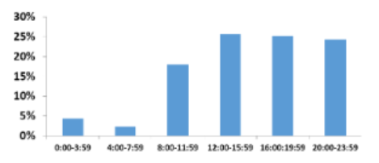
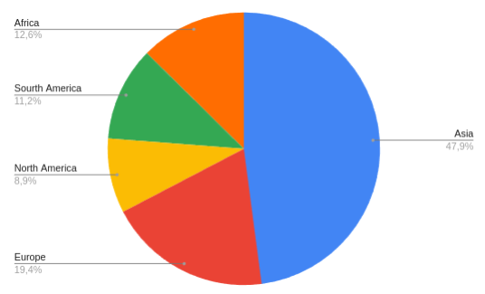

**Ильинский Владислав**

[Телеграм для связи](https://t.me/Vilin0)

[Методические указания](https://github.com/init/highload/blob/main/homework_architecture.md)

## 1. Тема, аудитория, функционал

### Тема: мессенджер Whatsapp

### MVP функционал

1. Отправка сообщений в чате.
2. Просмотр чата.
3. Вложения фото, видео, файлы, голосовые.
4. Поиск сообщений по чатам.
5. Группировка чатов по папкам.
6. Групповой чат с несколькими пользователями.
7. Статус сообщения(отправлено, доставлено, прочитано)

**Ключевые особенности**

* Эмоции на сообщения в виде смайликов.

* Голосовые звонки внутри мессенджера

* Проектировать будем с учетом отсутствия постоянного хранения сообщений на серверах.
Т.е. сообщения могут храниться только пока адресат не доступен. 
После доставки сообщения удаляются с серверов.
Можно хранить метаданные о статусе доставке, времени отправки, получения и т.д.

### Продуктовые метрики

| Метрика          | Значение |
|------------------|:--------:|
| Аудитория        | Весь мир |
| MAU              | 482  млн |
| DAU              | 193 млн  |
| Сообщений в день | 25 млрд  |

Я взял monthly active users(MAU) и количество сообщений в день
Whatsapp за 2022 с сайта [1] и поделил их на 5.

Daily active users(DAU) я взял с учетом сайтов [2] и [3]
приблизительно как 40% от MAU и поделил также на 5.

Т.к. распределение по количеству пользователей довольно равномерное по странам [4] 
не будем концентрироваться на определенный регион.

Примерно 32% всех сообщений прочитывается за минуту. 50% сообщений прочитывается за час [5].

Примерно 86% всех сообщений до 10 слов длинной [5].

Только 2% сообщений используют вложения [5].

В WhatsApp 76% чатов между двумя людьми(групповых чатов 24%).
Но в то же время в групповых чатах генерируется 50% общего объема сообщений [5].
Примерно равномерно 75% всех сообщений отправлены с 12 по 24ч
Около 18% всех отправлено сообщений с 8ч до 12ч см. рисунок 1. [5]

**Рисунок 1 Распределение сообщений в течении дня**

На рисунке 2 можно увидеть распределение аудитории по условным регионам, основанные на данных [4].
Сами расчеты посмотреть здесь [6].

**Рисунок 2 Распределение MAU по условным регионам**

## Список литературы

1. Сайт с статистикой Whatsapp https://www.bankmycell.com/blog/number-of-whatsapp-users/#1613581803631-96bfa-c1678a7f-e18553c4-2e8a2161-0689e002-e6d075e8-7b5a
2. Сайт с частотой использования ежедневно в США https://www.statista.com/statistics/814813/frequency-with-which-us-internet-users-visit-whatsapp/
3. Сайт с количеством ежедневных пользователей https://www.statista.com/statistics/730306/whatsapp-status-dau/
4. Сайт с MAU по странам https://worldpopulationreview.com/country-rankings/whatsapp-users-by-country
5. Сайт с исследованием 4 млн сообщений от 100 людей
https://www.researchgate.net/publication/299487660_WhatsApp_Usage_Patterns_and_Prediction_Models
6. Расчеты MAU по условным регионам https://docs.google.com/spreadsheets/d/1bwwJy5Y3Objel3J5x4IXkPFhqaDwpeiLdYi_NVZZPw0/edit?usp=sharing
